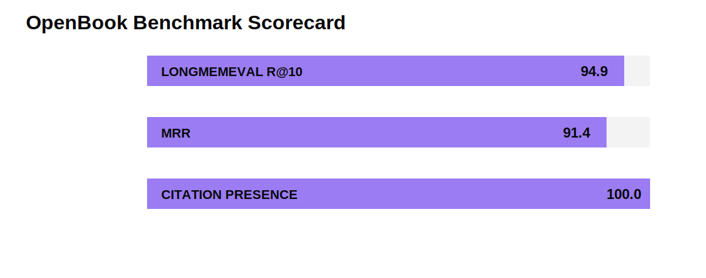
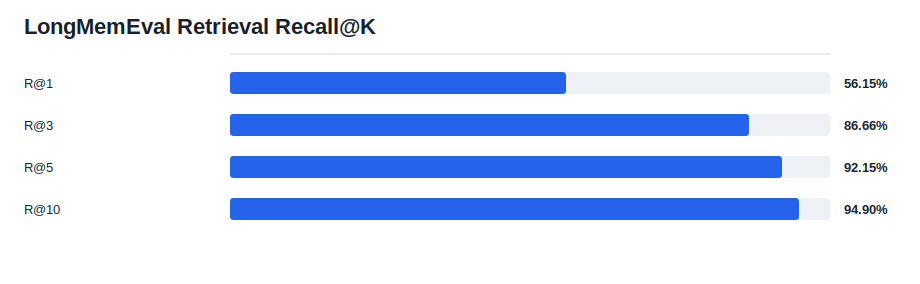
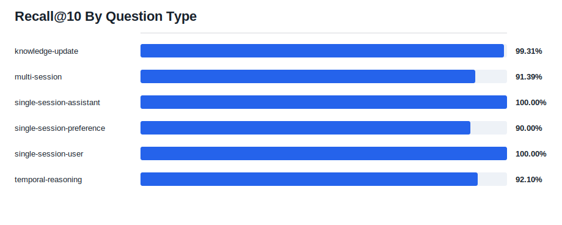
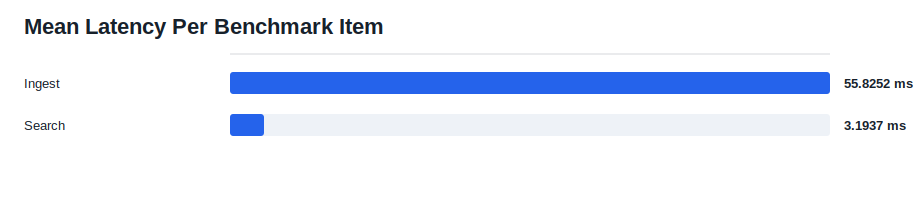

# OpenBook LongMemEval Retrieval Report

Dataset: `benchmarks\longmemeval\data\longmemeval_s_cleaned.json`
Track: `retrieval`
Retrieval mode: **fts**
Embedding provider: **none**
Embedding model: **(none)**
Loaded instances: **500**
Instances: **500**
Skipped abstention: **0**
Answerable: **470**
Abstention: **30**
QA enabled: **False**

## Run Metadata

- Generated at UTC: `2026-05-09T22:51:17.952650+00:00`
- OpenBook version: `0.1.0`
- Git commit: `aab570530e06c89da15de6a78115b70821619a63`
- Python: `3.12.13`
- Platform: `Windows-11-10.0.26200-SP0`
- Dataset SHA256: `d6f21ea9d60a0d56f34a05b609c79c88a451d2ae03597821ea3d5a9678c3a442`
- Command: `python benchmarks/longmemeval/openbook_longmemeval.py --download s --retrieval-mode fts --include-abstention --k 1,3,5,10 --report-dir benchmarks/longmemeval/results/openbook-longmemeval-s-fts-full-500`

## Headline Metrics

| Metric | Value |
| --- | ---: |
| HIT@1 | 87.45% |
| RECALL@1 | 56.15% |
| PRECISION@1 | 87.45% |
| NDCG@1 | 87.45% |
| HIT@3 | 94.47% |
| RECALL@3 | 86.66% |
| PRECISION@3 | 50.99% |
| NDCG@3 | 87.13% |
| HIT@5 | 96.81% |
| RECALL@5 | 92.15% |
| PRECISION@5 | 33.62% |
| NDCG@5 | 89.07% |
| HIT@10 | 98.30% |
| RECALL@10 | 94.90% |
| PRECISION@10 | 17.66% |
| NDCG@10 | 90.30% |
| MRR | 0.9143 |
| Mean ingest | 55.8252 ms |
| Mean search | 3.1937 ms |
| Citation presence | 100.00% |

## Charts

## By Question Type

| Question Type | Count | R@10 | Hit@10 | NDCG@10 | MRR | Search ms |
| --- | ---: | ---: | ---: | ---: | ---: | ---: |
| knowledge-update | 78 | 99.31% | 100.00% | 98.70% | 0.9931 | 2.4599 |
| multi-session | 133 | 91.39% | 98.35% | 87.29% | 0.9231 | 2.8049 |
| single-session-assistant | 56 | 100.00% | 100.00% | 99.34% | 0.9911 | 5.8802 |
| single-session-preference | 30 | 90.00% | 90.00% | 69.69% | 0.6300 | 3.2955 |
| single-session-user | 70 | 100.00% | 100.00% | 97.11% | 0.9615 | 2.1810 |
| temporal-reasoning | 133 | 92.10% | 97.64% | 85.85% | 0.8709 | 3.3918 |

## Notes

This is a retrieval benchmark. It measures whether OpenBook retrieves the gold evidence sessions from LongMemEval. It does not use an LLM judge and does not measure final answer correctness.
