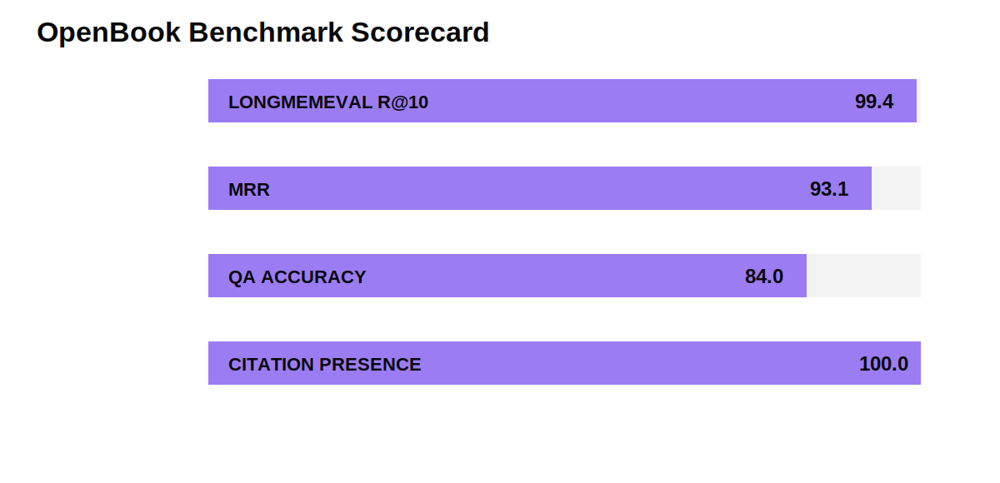
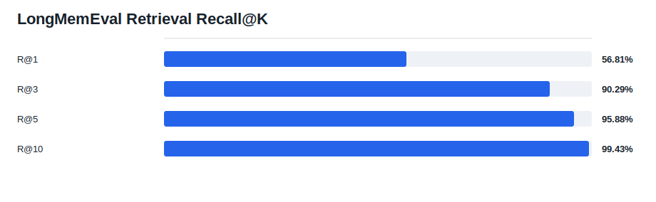
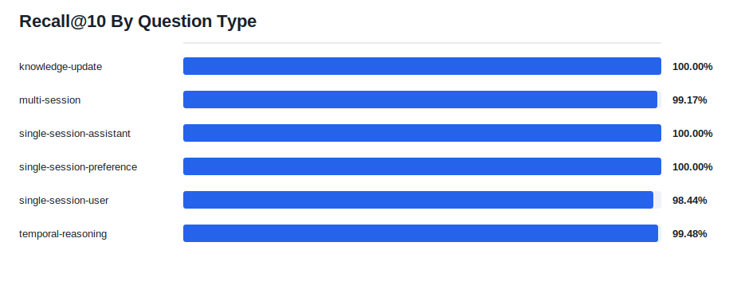
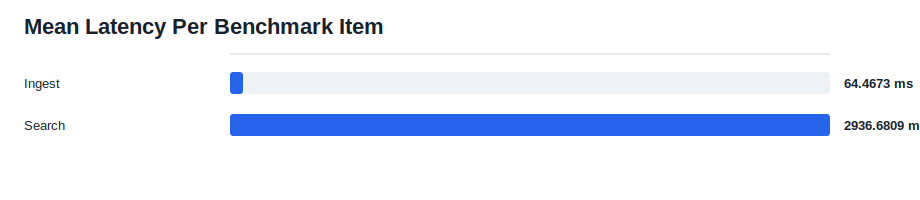

# OpenBook LongMemEval Retrieval Report

Dataset: `benchmarks\longmemeval\data\longmemeval_s_cleaned.json`
Track: `qa`
Retrieval mode: **hybrid**
Embedding provider: **gemini**
Embedding model: **gemini-embedding-2**
Loaded instances: **500**
Instances: **500**
Skipped abstention: **0**
Answerable: **470**
Abstention: **30**
QA enabled: **True**

## Run Metadata

- Generated at UTC: `2026-05-09T23:06:35.896919+00:00`
- OpenBook version: `0.1.0`
- Git commit: `aab570530e06c89da15de6a78115b70821619a63`
- Postprocessed with git commit: `5a802fa67c8febcaf5aac8156c8899b6df85d9f3`
- Python: `3.12.13`
- Platform: `Windows-11-10.0.26200-SP0`
- Dataset SHA256: `d6f21ea9d60a0d56f34a05b609c79c88a451d2ae03597821ea3d5a9678c3a442`
- Command: `python benchmarks/longmemeval/openbook_longmemeval.py --download s --retrieval-mode hybrid --embedding-provider gemini --embedding-model gemini-embedding-2 --embedding-batch-size 32 --qa --qa-top-k 10 --reader-provider gemini --reader-model gemini-3-flash-preview --judge-provider gemini --judge-model gemini-3.1-pro-preview --include-abstention --k 1,3,5,10 --report-dir benchmarks/longmemeval/results/openbook-longmemeval-s-gemini-full-v2`

## Headline Metrics

| Metric | Value |
| --- | ---: |
| HIT@1 | 89.15% |
| RECALL@1 | 56.81% |
| PRECISION@1 | 89.15% |
| NDCG@1 | 89.15% |
| HIT@3 | 97.02% |
| RECALL@3 | 90.29% |
| PRECISION@3 | 53.62% |
| NDCG@3 | 90.19% |
| HIT@5 | 98.51% |
| RECALL@5 | 95.88% |
| PRECISION@5 | 35.70% |
| NDCG@5 | 92.18% |
| HIT@10 | 99.57% |
| RECALL@10 | 99.43% |
| PRECISION@10 | 18.79% |
| NDCG@10 | 93.69% |
| MRR | 0.9311 |
| QA Accuracy | 84.00% |
| Mean ingest | 64.4673 ms |
| Mean search | 2936.6809 ms |
| Mean QA | 4645.8035 ms |
| Citation presence | 100.00% |

## Charts

## By Question Type

| Question Type | Count | R@10 | Hit@10 | NDCG@10 | MRR | Search ms |
| --- | ---: | ---: | ---: | ---: | ---: | ---: |
| knowledge-update | 78 | 100.00% | 100.00% | 99.07% | 0.9931 | 2538.0659 |
| multi-session | 133 | 99.17% | 99.17% | 93.90% | 0.9534 | 3153.2978 |
| single-session-assistant | 56 | 100.00% | 100.00% | 99.34% | 0.9911 | 2669.9443 |
| single-session-preference | 30 | 100.00% | 100.00% | 76.42% | 0.6856 | 3066.0131 |
| single-session-user | 70 | 98.44% | 98.44% | 96.50% | 0.9583 | 3567.0968 |
| temporal-reasoning | 133 | 99.48% | 100.00% | 90.61% | 0.8927 | 2705.1781 |

## Notes

This is a retrieval-augmented QA benchmark. It reports retrieval metrics and, when a judge provider is configured, judged answer correctness. Public comparisons must disclose the reader, judge, embedding model, retrieval mode, and context depth.
